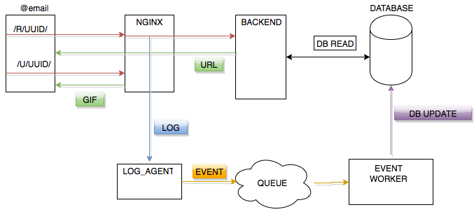

# td_tracker
A simple email open/click tracking system

Project provides some very basic capabilities to tracking email newsletter campaigns. Email should include a specially created urls to external pages and/or tracking pixel. When user follows url backend tracks this and redirects user to the original url. Tracking pixel is using to track "newsletter".

### Components

* backend server
* python module `newsletter`

### Overview

User follows url from email. Backend tracks all user requests. Reporting is provided by SQL queries from the database.

#### Backend

Backend is a python/Flask application which performs redirects to original url. Backends extracts request ID from a user request (/REQUEST_ID/), then backend performs look up by `ID` in SQL database. if `ID` is not found backend return 'not found' page.
Backend saves in the database original ID from user request and timestamp.

### python module `newsletter`

class `LetterURL`  provides function to get unique url for email campaigns based on the original url or a newsletter-specific url of tracking pixel. Please see script [db_create](db_create.py)

### Reporting

Please see possible queries in [Reports](REPORTS.md)

#### Current Bottlenecks

* Every url request causes 1 read query and 1 write request to the database
* Backend blocks on requests to database
* Tracking pixel url is the same always, do not need to query DB

### Scaling

Here is a diagram witch explants a better architecture for td_tracker.

Some key points here are

 * There are two types of requests
   * User request has '/u/' prefix and it goes to backend
   * Tracking pixel request has '/r/' prefix and it is handled by nginx itself. It doesn't hit backend
 * Nginx is reverse proxy and load balancer for multiple backends
 * Nginx tracks all requests in access_log
 * Log_agent extract click event from the local access_log file and puts them in shared queue for event_worker(s)
 * Backend used the database only for read, in scale it could be a read replica(s)
 * event_worker reads events from shared queue and performs asynchronous bunch updates for the database
 * A part of the id (for example 4 first chars) could be used to split data into multiple database instances.
